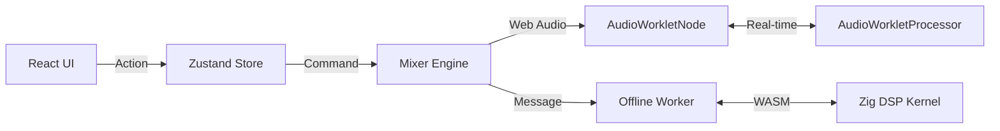

# Sonic-Core

[](https://opensource.org/licenses/MIT)
[](https://github.com/ray0404/Sonic-Core/actions)
[](https://github.com/ray0404/Sonic-Core/releases)

**Sonic-Core** is a high-performance, professional-grade, local-first audio mastering and processing platform. It bridges the gap between browser-based convenience and desktop Digital Audio Workstation (DAW) performance by leveraging cutting-edge web technologies like **AudioWorklets** for zero-latency processing and **Zig/WebAssembly** for heavy-duty offline DSP.

Sonic-Core is designed as a **Universal Audio Platform**, featuring a standalone headless core library, a rich Progressive Web App (PWA) interface, a powerful CLI for automation, and the ability to export DSP logic as native VST3/AU plugins.

---

## 📖 Table of Contents

- [Key Features](#-key-features)
- [Tech Stack](#-tech-stack)
- [Prerequisites](#-prerequisites)
- [Getting Started](#-getting-started)
- [Architecture](#-architecture)
- [The DSP Library](#-the-dsp-library)
- [CLI & Automation](#-cli--automation)
- [Testing](#-testing)
- [Deployment](#-deployment)
- [Troubleshooting](#-troubleshooting)
- [Contributing](#-contributing)
- [License](#-license)

---

## ✨ Key Features

- **🚀 Zero-Latency Real-Time Processing**: Highly optimized AudioWorklet processors running in a dedicated audio thread.
- **🛠️ Smart Offline DSP**: High-performance audio repair and normalization engine written in Zig and compiled to WebAssembly.
- **🔒 Local-First & Privacy-Centric**: All audio data stays on the user's device. No cloud uploads, no server-side processing.
- **📦 Universal Architecture**: A decoupled system consisting of a headless core (`sonic-core`), a React UI library, and a CLI engine.
- **🔌 Native Plugin Export**: Export your DSP logic directly to VST3 or Audio Unit (AU) formats for use in industry-standard DAWs.
- **📋 Director Batch Processing**: Automate complex audio workflows using a manifest-based manifest system.
- **💾 Resilient Persistence**: Automatic project state and audio buffer saving to IndexedDB via `idb-keyval`.

---

## 💻 Tech Stack

| Category | Technology |
|----------|------------|
| **Framework** | React 18 with Vite 5 |
| **Languages** | TypeScript 5.x, Zig 0.13.0 |
| **State Management** | Zustand (Global Store) |
| **Audio API** | Web Audio API (standardized-audio-context) |
| **DSP Core** | AudioWorklets (Real-time), WebAssembly (Offline) |
| **Styling** | Tailwind CSS, Framer Motion, Lucide React |
| **Persistence** | IndexedDB (`idb-keyval`) |
| **CLI** | Ink (React-based TUI), Commander, Puppeteer |
| **Testing** | Vitest, React Testing Library, JSDOM |

---

## 📋 Prerequisites

Before you begin, ensure you have the following installed:

- **Node.js**: `v18.0` or higher (LTS recommended)
- **Zig**: `0.13.0` (Required for compiling the DSP kernel)
- **Git**: For version control
- **Google Chrome / Chromium**: Required for the headless CLI engine

---

## 🚀 Getting Started

### 1. Clone the Repository

```bash
git clone https://github.com/ray0404/Sonic-Core.git
cd Sonic-Core
```

### 2. Install Dependencies

```bash
npm install
```

### 3. Build the DSP Kernel (WASM)

Sonic-Core requires the Zig-based DSP kernel to be compiled to WebAssembly before the engine can function.

```bash
npm run build:wasm
```

### 4. Start Development Server

```bash
npm run dev
```

The Web Application will be available at [http://localhost:5173](http://localhost:5173).

### 5. Start the CLI (TUI)

```bash
npm run dev:cli
```

---

## 🏗️ Architecture

Sonic-Core follows a strict **Three-Layer Architecture** to respect Web Audio API thread boundaries and ensure UI responsiveness.

### 1. Intent Layer (UI & State)
*   **Path**: `src/`
*   **Role**: Manages visual state and user intent. It does not touch audio buffers directly.
*   **Key Source**: `src/store/useAudioStore.ts`
*   **Behavior**: Updates the Zustand store, which triggers subscriptions in the Orchestration layer.

### 2. Orchestration Layer (Audio Engine)
*   **Path**: `packages/sonic-core/`
*   **Role**: Translates state changes into imperative Web Audio API calls. Manages the lifecycle of `AudioContext`, `AudioNodes`, and connections.
*   **Entry Point**: `packages/sonic-core/src/mixer.ts`

### 3. Processing Layer (DSP)
*   **Path**: `packages/sonic-core/src/worklets/` (Real-time) & `libs/sonic-dsp-kernel/` (Zig)
*   **Role**: Performs mathematical manipulation of audio samples in isolated threads (Audio Thread or Worker Thread).

### Data Flow Pattern



---

## 🎛️ The DSP Library

Sonic-Core features a comprehensive library of over 30 high-quality audio processors:

### Real-Time Modules (AudioWorklets)
- **Dynamics**: Compressor, Limiter, Transient Shaper, De-Esser.
- **EQ**: Parametric EQ, Mid-Side EQ, Dynamic EQ.
- **Time/Modulation**: Feedback Delay, Chorus, Phaser, Tremolo.
- **Saturation/Lo-Fi**: Saturation, Distortion, BitCrusher.
- **Utility**: Stereo Imager, Metering, Dithering.

### Smart Offline Processors (Zig/WASM)
- **Loudness Normalization**: Analysis and gain adjustment to specific LUFS targets (e.g., -14 LUFS).
- **Phase Rotation**: Smears transients to recover headroom without affecting perceived loudness.
- **De-Clipper**: Restores clipped peaks using cubic Hermite spline interpolation.
- **Spectral Denoise**: FFT-based adaptive noise reduction.
- **Voice Isolate**: Advanced spectral subtraction for vocal clarity.
- **De-Bleed**: Intelligent bleed removal for multi-track recordings.

---

## 🖥️ CLI & Automation

Sonic-Core includes a powerful CLI (`cli/index.ts`) for headless audio processing.

### Interactive TUI
Launch a React-based terminal interface to manage projects:
```bash
npm run dev:cli
```

### Batch Processing (The Director)
Process multiple files using a `.sonic` manifest:
```bash
npx tsx cli/index.ts director manifest.json ./input ./output --parallel 4
```

### Native Plugin Export
Export your DSP configurations as native binaries:
```bash
# Export as VST3
npx tsx cli/index.ts export vst3 --plugin compressor

# Export as AU (macOS only)
npx tsx cli/index.ts export au --plugin limiter
```

---

## 🧪 Testing

We use **Vitest** for a unified testing experience across the core and UI.

```bash
# Run all tests
npm test

# Run tests with UI reporter
npx vitest --ui

# Run coverage report
npx vitest run --coverage
```

### Writing a Test
Tests are co-located with their logic. Example for a utility:
```typescript
import { describe, it, expect } from 'vitest';
import { calculateLoudness } from './loudness';

describe('calculateLoudness', () => {
  it('should correctly measure -0.1 dBFS peaks', () => {
    const buffer = new Float32Array([0.99, -0.99]);
    expect(calculateLoudness(buffer)).toBeCloseTo(-0.1);
  });
});
```

---

## 🚀 Deployment

### Firebase Hosting (PWA)
The project is optimized for deployment to Firebase Hosting.

```bash
# Build the application
npm run build

# Deploy to Firebase
firebase deploy
```

### Headless Environments
For CI/CD or server-side rendering, ensure the environment has Chromium installed for Puppeteer:
```bash
# Example for Ubuntu/Debian
sudo apt-get install chromium-browser
```

---

## 🛠️ Troubleshooting

### Zig Build Failures
**Error**: `zig: command not found`
**Solution**: Ensure Zig `0.13.0` is in your system `PATH`. Download it from [ziglang.org](https://ziglang.org/download/).

### AudioContext Not Starting
**Symptom**: No audio output or meters are frozen.
**Solution**: Browsers require a user gesture (click/keypress) to start audio. Click the "Start Engine" button on the overlay.

### WASM Memory Errors
**Error**: `Out of memory` in Worker.
**Solution**: This typically happens when processing extremely large files (>1 hour). The WASM heap is currently capped at 2GB. Try splitting the file or increasing the allocation in `src/audio/workers/offline-processor.worker.ts`.

### CLI Puppeteer Issues
**Error**: `Failed to launch browser instance`.
**Solution**: Run `npx puppeteer install` to ensure the internal Chromium binary is downloaded, or point to your local installation using the `CHROME_PATH` env var.

---

## 🤝 Contributing

We welcome contributions! Please follow the code conventions outlined in [AGENTS.md](./AGENTS.md).

1.  Fork the Project
2.  Create your Feature Branch (`git checkout -b feature/AmazingFeature`)
3.  Commit your Changes (`git commit -m 'Add some AmazingFeature'`)
4.  Push to the Branch (`git push origin feature/AmazingFeature`)
5.  Open a Pull Request

---

## 📄 License

Distributed under the MIT License. See `LICENSE` for more information.

---

**Developed with ❤️ by Ray Valentin**
GitHub: [@ray0404](https://github.com/ray0404) | Project: [Sonic-Core](https://github.com/ray0404/Sonic-Core)
